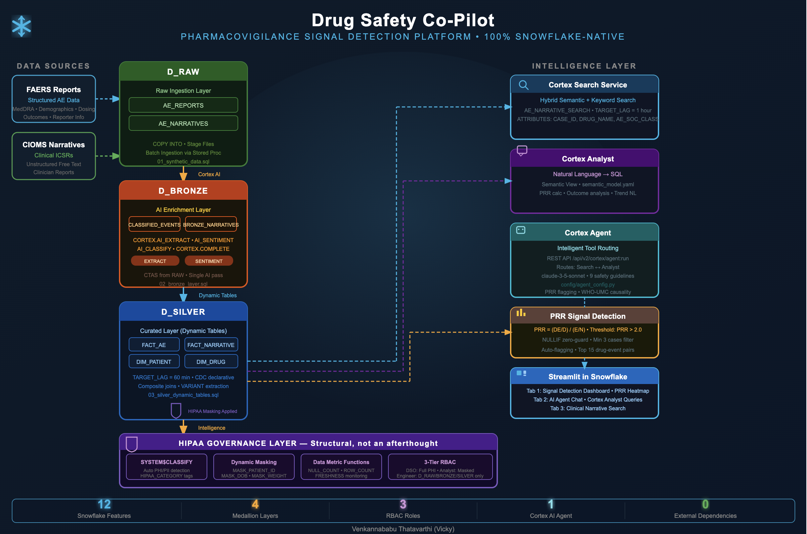
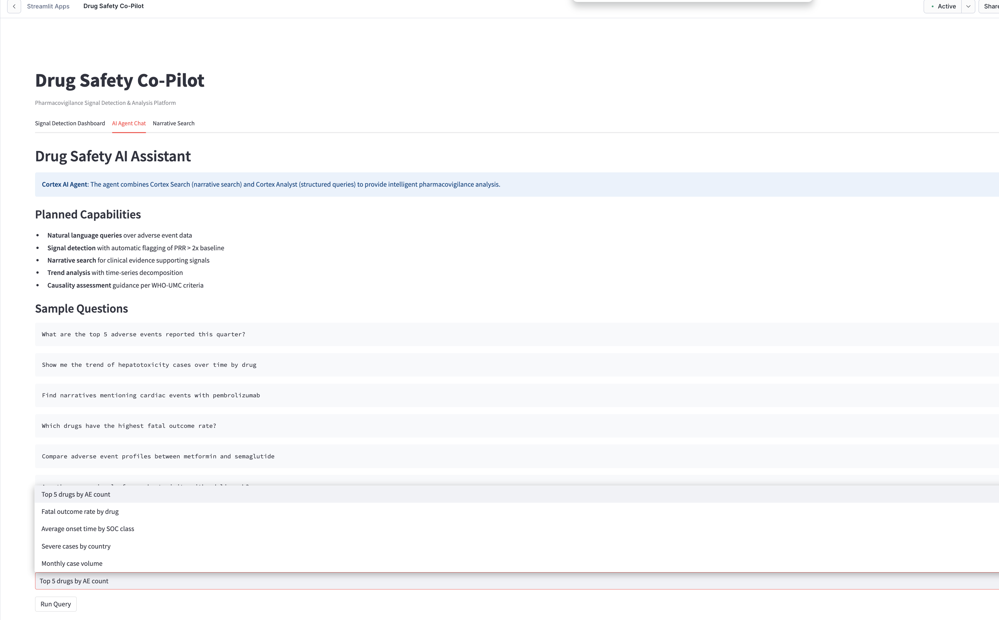
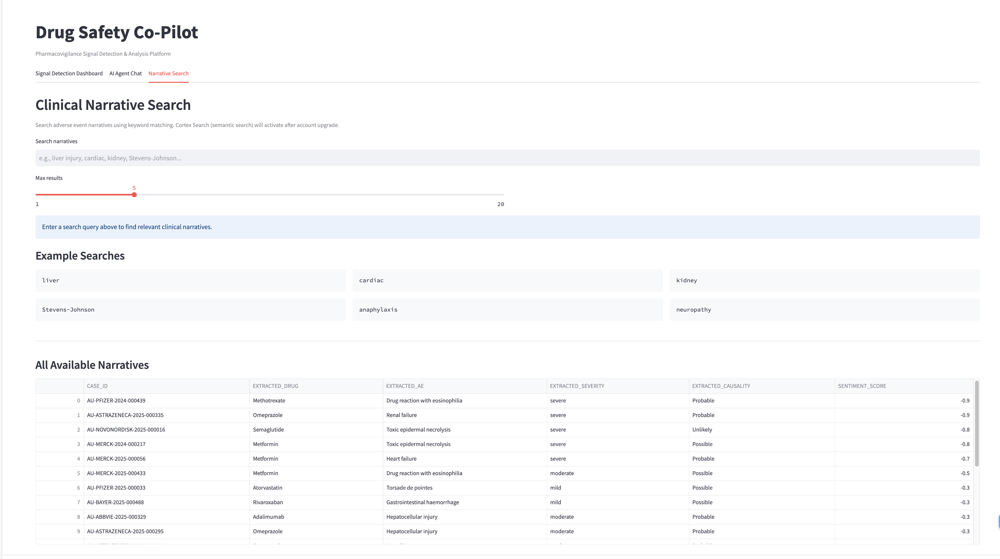

# Drug Safety Co-Pilot

**Production Pharmacovigilance Signal Detection Platform on Snowflake**



---

## Overview

The **Drug Safety Co-Pilot** is a production-grade pharmacovigilance signal detection platform built entirely on the Snowflake Data Cloud. It ingests both structured adverse event (AE) case reports and unstructured clinical narratives, enriches them with Snowflake Cortex AI, enforces HIPAA-grade governance, and surfaces insights through a conversational AI agent and interactive Streamlit dashboard — all without leaving Snowflake.

The platform enables Drug Safety Officers and Pharmacovigilance Analysts to detect, investigate, and report adverse event signals in near real-time — replacing fragmented spreadsheet workflows and siloed safety databases with a single, governed, AI-native intelligence layer.

---

## Key Features

- **Medallion Architecture** — RAW → BRONZE → SILVER → GOLD with declarative CDC via Dynamic Tables (5-minute refresh lag)
- **Cortex AI Enrichment** — AI_CLASSIFY (SOC categorization), AI_EXTRACT (structured field extraction from narratives), SENTIMENT (clinical tone scoring)
- **Cortex Search Service** — Hybrid semantic + keyword search over clinical ICSR narratives
- **Cortex Analyst + Semantic View** — Natural language to SQL over structured AE data
- **Cortex Agent** — Conversational copilot with tool routing between Search and Analyst
- **Signal Detection** — Proportional Reporting Ratio (PRR) calculation, severity heatmaps, temporal trend analysis
- **HIPAA Governance** — SYSTEM$CLASSIFY for auto PHI/PII detection, dynamic data masking, object tags, data metric functions
- **RBAC** — Three-role security model (DRUG_SAFETY_OFFICER, DATA_ENGINEER, PV_ANALYST)
- **Streamlit in Snowflake** — Interactive 3-tab dashboard deployed natively

---

## Technology Stack

| Component | Snowflake Service | Purpose |
|-----------|-------------------|---------|
| Data Generation | CORTEX.COMPLETE (claude-4-sonnet) | Realistic synthetic FAERS-style AE records + CIOMS narratives |
| Classification | SNOWFLAKE.CORTEX.AI_CLASSIFY | System Organ Class (SOC) categorization |
| Extraction | SNOWFLAKE.CORTEX.AI_EXTRACT | Structured field extraction from narrative text |
| Sentiment | SNOWFLAKE.CORTEX.SENTIMENT | Clinical narrative tone scoring |
| CDC Pipeline | Dynamic Tables (TARGET_LAG = 5 min) | Declarative change data capture |
| Semantic Search | Cortex Search Service | Hybrid search over clinical narratives |
| NL-to-SQL | Cortex Analyst + Semantic View | Natural language queries over AE data |
| AI Agent | Cortex Agent | Tool-routing copilot (Search + Analyst) |
| Governance | SYSTEM$CLASSIFY, Masking Policies, Tags, DMFs | HIPAA compliance automation |
| Visualization | Streamlit in Snowflake | Interactive signal detection dashboard |

---

## Architecture

```
Data Sources          Medallion Architecture                    Gold / AI Layer
─────────────         ────────────────────────                 ────────────────
                      ┌─────────┐   ┌──────────┐   ┌──────────────┐
FAERS AE Reports ───▶ │  D_RAW  │──▶│ D_BRONZE │──▶│   D_SILVER   │
(Structured)          │         │   │          │   │              │
                      │AE_      │   │CLASSIFIED│   │DIM_PATIENT   │
Clinical Narratives ─▶│REPORTS  │   │_EVENTS   │   │DIM_DRUG      │
(Unstructured Text)   │AE_      │   │ENRICHED_ │   │FACT_ADVERSE  │
                      │NARRATIVES   │NARRATIVES│   │_EVENT        │
                      └─────────┘   └──────────┘   │FACT_NARRATIVE│
                                         ▲          └──────┬───────┘
                                    Cortex AI              │
                                    Functions              ▼
                                                    ┌──────────────┐
                                                    │    D_GOLD    │
                                                    │              │
                                                    │Cortex Search │
                                                    │Cortex Analyst│
                                                    │Cortex Agent  │
                                                    └──────┬───────┘
                                                           │
                                                           ▼
                                                    ┌──────────────┐
                                                    │  Streamlit   │
                                                    │  Dashboard   │
                                                    └──────────────┘
```

---

## Project Structure

```
drug_safety_copilot/
├── sql/
│   ├── 00_setup.sql                 # Database, schemas, warehouse, RBAC
│   ├── 01_synthetic_data.sql        # Realistic FAERS-style data generation
│   ├── 02_bronze_layer.sql          # AI_CLASSIFY, AI_EXTRACT, SENTIMENT enrichment
│   ├── 03_silver_dynamic_tables.sql # Dynamic Tables (DIM/FACT star schema)
│   ├── 04_governance.sql            # Masking policies, HIPAA tags, DMFs
│   ├── 05_gold_search.sql           # Cortex Search Service creation
│   ├── 06_gold_semantic_view.sql    # Semantic View for Cortex Analyst
│   └── 07_streamlit_deploy.sql      # Streamlit app deployment DDL
├── config/
│   └── agent_config.py              # Cortex Agent configuration (tools + instructions)
├── streamlit/
│   └── app.py                       # 3-tab Streamlit dashboard application
├── semantic_model.yaml              # Cortex Analyst semantic model definition
├── docs/
│   ├── architecture.png             # Architecture diagram
│   ├── ai_agent.png                 # AI Agent Chat screenshot
│   └── narrative_search.png         # Narrative Search screenshot
├── .gitignore
└── README.md
```

---

## Medallion Architecture Detail

| Layer | Schema | Tables | Purpose |
|-------|--------|--------|---------|
| **Raw** | D_RAW | AE_REPORTS, AE_NARRATIVES | Immutable landing zone for source data |
| **Bronze** | D_BRONZE | CLASSIFIED_EVENTS, ENRICHED_NARRATIVES | Cortex AI enrichment (classify, extract, sentiment) |
| **Silver** | D_SILVER | DIM_PATIENT, DIM_DRUG, FACT_ADVERSE_EVENT, FACT_NARRATIVE | Star schema via Dynamic Tables with 5-min CDC |
| **Gold** | D_GOLD | Cortex Search, Semantic View, Cortex Agent | AI intelligence and analytics layer |

---

## Prerequisites

- Snowflake **Enterprise Edition** (or higher)
- **ACCOUNTADMIN** role access
- Cortex AI functions enabled (COMPLETE, AI_CLASSIFY, AI_EXTRACT, SENTIMENT)
- Cross-region inference enabled (`CORTEX_ENABLED_CROSS_REGION = 'ANY_REGION'`)
- Available LLM model: `claude-4-sonnet` (or equivalent)

---

## Deployment

Execute the SQL scripts in order:

```bash
# Step 1: Foundation (database, schemas, warehouse, roles)
-- Execute: sql/00_setup.sql

# Step 2: Generate realistic synthetic data (~500 AE records + 20 narratives)
-- Execute: sql/01_synthetic_data.sql

# Step 3: Bronze layer enrichment (AI classification + extraction)
-- Execute: sql/02_bronze_layer.sql

# Step 4: Silver Dynamic Tables (star schema with CDC)
-- Execute: sql/03_silver_dynamic_tables.sql

# Step 5: Governance (masking, tags, data quality metrics)
-- Execute: sql/04_governance.sql

# Step 6: Cortex Search Service (narrative search index)
-- Execute: sql/05_gold_search.sql

# Step 7: Semantic View for Cortex Analyst
-- Execute: sql/06_gold_semantic_view.sql

# Step 8: Deploy Streamlit dashboard
-- Execute: sql/07_streamlit_deploy.sql
```

Each script is idempotent (`CREATE OR REPLACE`) and can be re-run safely.

---

## Screenshots

### AI Agent Chat
Natural language interface powered by Cortex Agent with tool routing between structured queries and narrative search.



### Narrative Search
Semantic search over clinical adverse event narratives using Cortex Search Service.



---

## Governance & Security

| Capability | Implementation |
|------------|---------------|
| **PHI Auto-Detection** | `SYSTEM$CLASSIFY` on DIM_PATIENT identifies PII/PHI columns |
| **Dynamic Masking** | Role-based: DSO sees clear text, PV_ANALYST sees SHA2 hash / redacted |
| **HIPAA Object Tags** | `HIPAA_CATEGORY` tag applied to sensitive columns |
| **Data Quality** | Data Metric Functions (ROW_COUNT, FRESHNESS) on critical tables |
| **RBAC** | DRUG_SAFETY_OFFICER (full PHI) → DATA_ENGINEER (pipeline) → PV_ANALYST (read, masked) |
| **Audit** | Access history via Snowflake's built-in ACCESS_HISTORY view |

---

## Domain Context

### Pharmacovigilance (PV)
The science of detecting, assessing, understanding, and preventing adverse effects of medicines. Regulatory bodies (FDA, EMA, PMDA) mandate continuous post-market safety monitoring.

### Key Concepts
- **FAERS** — FDA Adverse Event Reporting System
- **ICSR** — Individual Case Safety Report
- **CIOMS** — Council for International Organizations of Medical Sciences (narrative report format)
- **MedDRA** — Medical Dictionary for Regulatory Activities (standardized AE terminology)
- **SOC** — System Organ Class (top-level MedDRA categorization)
- **PRR** — Proportional Reporting Ratio (signal detection statistic)
- **AE** — Adverse Event

---

## Signal Detection Methodology

The platform calculates **Proportional Reporting Ratio (PRR)** for drug-event combinations:

```
PRR = (a / (a + b)) / (c / (c + d))

Where:
  a = cases of target event with target drug
  b = cases of all other events with target drug
  c = cases of target event with all other drugs
  d = cases of all other events with all other drugs

Signal threshold: PRR >= 2.0 AND case count >= 3
```

---

## Synthetic Data Characteristics

The generated data mimics real-world FAERS reporting patterns:
- **Case IDs**: FAERS format (`US-PHARMA-2024-NNNNNN`)
- **Drug names**: Top-50 prescribed medications with clinical doses (e.g., "Metformin 500mg BID")
- **AE terms**: Real MedDRA Preferred Terms (e.g., "Hepatocellular injury", "Stevens-Johnson syndrome")
- **Demographics**: Age bell curve 45-75, ~55% female, weighted country distribution
- **Reporter types**: Physician (40%), pharmacist (20%), consumer (30%), other HCP (10%)
- **Temporal patterns**: Onset 1-90 days post drug start with realistic reporting lag

---

## Author

**Venkannababu Thatavarthi (Vicky)**
Senior Snowflake Architect | Squadron Data, Inc.

---

## License

MIT License. See [LICENSE](LICENSE) for details.
