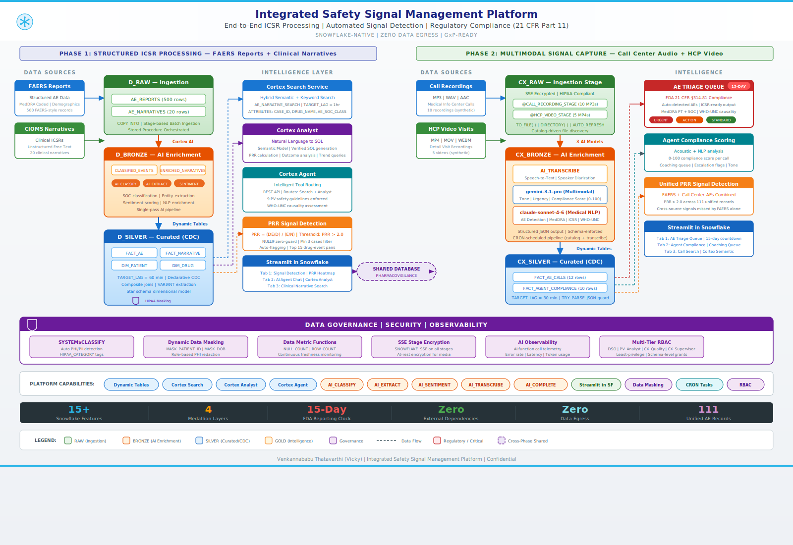

# Integrated Safety Signal Management Platform

**End-to-End ICSR Processing | Automated Signal Detection | Regulatory Compliance (21 CFR Part 11)**

Snowflake-Native | Zero Data Egress | GxP-Ready

---



---

## Overview

This platform is a production-grade pharmacovigilance signal detection system built entirely on Snowflake. It processes structured adverse event reports, unstructured clinical narratives, and multimodal call center audio/video — all enriched with Cortex AI, governed under HIPAA, and surfaced through interactive Streamlit dashboards. No data leaves the Snowflake platform.

The system is deployed in two phases:

- **Phase 1 (Drug Safety Co-Pilot)** — Ingests FAERS-style structured AE reports and CIOMS clinical narratives, enriches them with AI classification and entity extraction, and provides a conversational AI copilot for Drug Safety Officers to detect and investigate signals.

- **Phase 2 (PharmaCX Intelligence)** — Extends into multimodal signal capture from Medical Information call center recordings and HCP video visits, using speech-to-text transcription, acoustic intelligence, and automated MedDRA-coded AE extraction. Both phases feed into a unified signal detection pipeline.

---

## Key Features

### Phase 1: Structured ICSR Processing

- **Medallion Architecture** — RAW → BRONZE → SILVER → GOLD with declarative CDC via Dynamic Tables (60-min refresh)
- **Cortex AI Enrichment** — AI_CLASSIFY (SOC categorization), AI_EXTRACT (structured field extraction), SENTIMENT (clinical tone scoring)
- **Cortex Search Service** — Hybrid semantic + keyword search over clinical ICSR narratives
- **Cortex Analyst** — Natural language to verified SQL over structured AE data via Semantic Model
- **Cortex Agent** — Conversational copilot with intelligent tool routing between Search and Analyst
- **PRR Signal Detection** — Proportional Reporting Ratio calculation with auto-flagging (threshold: PRR > 2.0, min 3 cases)
- **Streamlit Dashboard** — 3-tab interface: Signal Detection Heatmap, AI Agent Chat, Clinical Narrative Search

### Phase 2: Multimodal Signal Capture

- **AI_TRANSCRIBE** — Speech-to-text conversion of call recordings with speaker diarization
- **Multimodal AI_COMPLETE** — gemini-3.1-pro processes audio/video for tone, urgency, and compliance scoring (5-arg form)
- **Medical NLP Extraction** — claude-sonnet-4-6 detects AEs, codes to MedDRA PT/SOC, extracts ICSR fields, assesses WHO-UMC causality
- **AE Triage Queue** — Auto-prioritized queue (URGENT / ACTION / STANDARD) with FDA 15-day countdown
- **Agent Compliance Scoring** — 0-100 score per call based on acoustic analysis and script adherence
- **Unified Signal Detection** — PRR recalculated across combined FAERS + call center sources (111 unified records)
- **CRON Automation** — Snowflake Tasks for catalog refresh and transcription pipeline (30-min schedule)
- **AI Observability** — Telemetry logging for all AI function calls (latency, error rate, token usage)

---

## Platform Capabilities (16 Snowflake Features)

| # | Feature | Category | Usage |
|---|---------|----------|-------|
| 1 | AI_CLASSIFY | Cortex AI | Classifies AEs into MedDRA System Organ Classes |
| 2 | AI_EXTRACT | Cortex AI | Extracts structured entities from clinical narratives |
| 3 | AI_SENTIMENT | Cortex AI | Scores narrative sentiment for priority flagging |
| 4 | AI_TRANSCRIBE | Cortex AI | Speech-to-text with speaker diarization |
| 5 | AI_COMPLETE (Multimodal) | Cortex AI | Audio/video analysis with gemini-3.1-pro |
| 6 | AI_COMPLETE (Text) | Cortex AI | Medical NLP with claude-sonnet-4-6 |
| 7 | Dynamic Tables | Data Engineering | Declarative CDC pipeline (TARGET_LAG based) |
| 8 | Cortex Search Service | Intelligence | Hybrid semantic + keyword search |
| 9 | Cortex Analyst | Intelligence | Natural language to verified SQL |
| 10 | Cortex Agent | Intelligence | Intelligent tool routing (Search + Analyst) |
| 11 | Streamlit in Snowflake | Application | Interactive dashboards deployed natively |
| 12 | Dynamic Data Masking | Governance | Role-based PHI redaction |
| 13 | SYSTEM$CLASSIFY | Governance | Auto PHI/PII detection and tagging |
| 14 | Data Metric Functions | Governance | Continuous data quality monitoring |
| 15 | Snowflake Tasks | Automation | CRON-scheduled pipeline execution |
| 16 | RBAC | Security | Multi-tier least-privilege access control |

Additional: SSE Stage Encryption, Semantic Model (YAML), VARIANT data type, AI Observability (Event Table)

---

## Architecture Detail

### Phase 1: Medallion Layers

| Layer | Schema | Tables | Purpose |
|-------|--------|--------|---------|
| **Raw** | D_RAW | AE_REPORTS (500 rows), AE_NARRATIVES (20 rows) | Immutable ingestion zone |
| **Bronze** | D_BRONZE | CLASSIFIED_EVENTS, ENRICHED_NARRATIVES | Cortex AI enrichment (classify, extract, sentiment) |
| **Silver** | D_SILVER | DIM_PATIENT, DIM_DRUG, FACT_ADVERSE_EVENT, FACT_NARRATIVE | Star schema via Dynamic Tables (TARGET_LAG = 60 min) |
| **Gold** | D_GOLD | Cortex Search, Semantic View, Cortex Agent, PRR Analytics | AI intelligence and analytics layer |

### Phase 2: CX Layers

| Layer | Schema | Tables | Purpose |
|-------|--------|--------|---------|
| **Raw** | CX_RAW | CALL_CATALOG (10 MP3s), HCP_VIDEO_CATALOG (5 MP4s) | SSE-encrypted stage ingestion |
| **Bronze** | CX_BRONZE | CALL_TRANSCRIPTIONS, HCP_VIDEO_TRANSCRIPTIONS, CALL_AUDIO_INTELLIGENCE, CALL_AE_EXTRACTIONS | 3-model AI pipeline |
| **Silver** | CX_SILVER | FACT_AE_CALLS (12 rows), FACT_AGENT_COMPLIANCE (10 rows) | Dynamic Tables (TARGET_LAG = 30 min) |
| **Gold** | CX_GOLD | V_AE_TRIAGE_QUEUE, V_UNIFIED_AE_SIGNAL (111 rows) | Triage + unified cross-source signal detection |

---

## Project Structure

```
drug_safety_copilot/
├── sql/
│   ├── 00_setup.sql                    # Database, schemas, warehouse, RBAC
│   ├── 01_synthetic_data.sql           # FAERS-style data generation (500 AE + 20 narratives)
│   ├── 02_bronze_layer.sql             # AI_CLASSIFY, AI_EXTRACT, SENTIMENT enrichment
│   ├── 03_silver_dynamic_tables.sql    # Dynamic Tables (DIM/FACT star schema)
│   ├── 04_governance.sql               # Masking policies, HIPAA tags, DMFs
│   ├── 05_gold_search.sql              # Cortex Search Service
│   ├── 06_gold_semantic_view.sql       # Semantic View for Cortex Analyst
│   ├── 07_streamlit_deploy.sql         # Phase 1 Streamlit deployment
│   ├── cx_00_setup.sql                 # CX schemas, SSE stages, roles
│   ├── cx_02_catalogs.sql              # CALL_CATALOG + HCP_VIDEO_CATALOG
│   ├── cx_03_transcription.sql         # AI_TRANSCRIBE with speaker diarization
│   ├── cx_04_audio_intelligence.sql    # gemini-3.1-pro multimodal analysis
│   ├── cx_05_ae_extraction.sql         # claude-sonnet-4-6 MedDRA/ICSR extraction
│   ├── cx_06_silver_dynamic_tables.sql # FACT_AE_CALLS + FACT_AGENT_COMPLIANCE
│   ├── cx_07_gold_views.sql            # V_AE_TRIAGE_QUEUE + V_UNIFIED_AE_SIGNAL
│   ├── cx_08_tasks.sql                 # CRON tasks (catalog refresh + transcription)
│   └── cx_10_observability.sql         # AI telemetry monitoring + alerting
├── config/
│   └── agent_config.py                 # Cortex Agent configuration (tools + safety guidelines)
├── streamlit/
│   ├── app.py                          # Phase 1: Signal Detection + AI Chat + Narrative Search
│   └── cx_app.py                       # Phase 2: AE Triage + Compliance + Call Search
├── tests/
│   └── test_cx_sql_correctness.py      # 21 validation tests for Phase 2 SQL
├── docs/
│   ├── architecture_unified.svg        # Unified architecture diagram (both phases)
│   ├── architecture.png                # Phase 1 architecture (legacy)
│   ├── ai_agent.png                    # AI Agent Chat screenshot
│   └── narrative_search.png            # Narrative Search screenshot
├── semantic_model.yaml                 # Cortex Analyst semantic model definition
├── .gitignore
└── README.md
```

---

## Deployment

### Prerequisites

- Snowflake **Enterprise Edition** (or higher)
- **ACCOUNTADMIN** role access
- Cortex AI functions enabled (COMPLETE, AI_CLASSIFY, AI_EXTRACT, SENTIMENT, AI_TRANSCRIBE)
- Cross-region inference enabled (`CORTEX_ENABLED_CROSS_REGION = 'ANY_REGION'`)
- Available LLM models: `claude-4-sonnet`, `gemini-3.1-pro`
- For Phase 2: SSE-encrypted stages for audio/video files

### Phase 1: Drug Safety Co-Pilot

Execute in order:

```bash
# Step 1: Foundation (database, schemas, warehouse, roles)
sql/00_setup.sql

# Step 2: Generate synthetic data (500 AE records + 20 narratives)
sql/01_synthetic_data.sql

# Step 3: Bronze layer enrichment (AI classification + extraction)
sql/02_bronze_layer.sql

# Step 4: Silver Dynamic Tables (star schema with CDC)
sql/03_silver_dynamic_tables.sql

# Step 5: Governance (masking, tags, data quality metrics)
sql/04_governance.sql

# Step 6: Cortex Search Service
sql/05_gold_search.sql

# Step 7: Semantic View for Cortex Analyst
sql/06_gold_semantic_view.sql

# Step 8: Deploy Streamlit dashboard
sql/07_streamlit_deploy.sql
```

### Phase 2: PharmaCX Intelligence

Execute in order (requires Phase 1 completed first):

```bash
# Step 1: CX schemas, SSE stages, extended RBAC
sql/cx_00_setup.sql

# Step 2: Call and video catalogs
sql/cx_02_catalogs.sql

# Step 3: AI_TRANSCRIBE with speaker diarization
sql/cx_03_transcription.sql

# Step 4: Multimodal audio intelligence (gemini-3.1-pro)
sql/cx_04_audio_intelligence.sql

# Step 5: AE extraction with MedDRA coding (claude-sonnet-4-6)
sql/cx_05_ae_extraction.sql

# Step 6: Silver Dynamic Tables (FACT_AE_CALLS + FACT_AGENT_COMPLIANCE)
sql/cx_06_silver_dynamic_tables.sql

# Step 7: Gold views (Triage Queue + Unified Signal Detection)
sql/cx_07_gold_views.sql

# Step 8: CRON tasks (automated catalog refresh + transcription)
sql/cx_08_tasks.sql

# Step 9: AI Observability (telemetry + alerting)
sql/cx_10_observability.sql
```

All scripts are idempotent (`CREATE OR REPLACE`) and can be re-run safely.

---

## Signal Detection Methodology

The platform calculates **Proportional Reporting Ratio (PRR)** for drug-event combinations:

```
PRR = (a / (a + b)) / (c / (c + d))

Where:
  a = cases of target event with target drug
  b = cases of all other events with target drug
  c = cases of target event with all other drugs
  d = cases of all other events with all other drugs

Signal threshold: PRR >= 2.0 AND case count >= 3
Zero-guard: NULLIF applied to prevent division by zero
```

In Phase 2, PRR is recalculated across the **unified dataset** (FAERS structured reports + call center detected AEs), surfacing cross-source signals that would be missed by either source alone.

---

## Governance & Security

| Capability | Implementation |
|------------|---------------|
| **PHI Auto-Detection** | `SYSTEM$CLASSIFY` identifies PII/PHI columns and applies HIPAA_CATEGORY tags |
| **Dynamic Masking** | Role-based: DSO sees full PHI, PV_ANALYST sees redacted/hashed values |
| **SSE Encryption** | SNOWFLAKE_SSE applied to all audio/video stages — mandatory for AI function processing |
| **Data Quality** | Data Metric Functions (ROW_COUNT, NULL_COUNT, FRESHNESS) on pipeline tables |
| **AI Observability** | Event table logging for all Cortex AI calls — latency, errors, token usage |
| **RBAC** | 4-tier model: DRUG_SAFETY_OFFICER → PV_ANALYST → CX_QUALITY_ANALYST → CX_SUPERVISOR → DATA_ENGINEER |
| **Audit** | Access history via Snowflake built-in ACCESS_HISTORY view |

---

## Domain Context

### Pharmacovigilance (PV)

The science of detecting, assessing, understanding, and preventing adverse effects of medicines. Regulatory bodies (FDA, EMA, PMDA) mandate continuous post-market safety monitoring with strict reporting timelines.

### Key Terms

| Term | Definition |
|------|-----------|
| **FAERS** | FDA Adverse Event Reporting System |
| **ICSR** | Individual Case Safety Report — standardized format for reporting an AE case |
| **MedDRA** | Medical Dictionary for Regulatory Activities — hierarchical AE coding system (SOC → PT) |
| **PRR** | Proportional Reporting Ratio — statistical signal detection method |
| **15-Day Rule** | FDA mandates expedited reporting of serious unexpected AEs within 15 calendar days |
| **21 CFR Part 11** | FDA regulation for electronic records — requires audit trails, access controls, data integrity |
| **WHO-UMC Causality** | Standardized scale: Certain → Probable → Possible → Unlikely → Conditional → Unassessable |
| **HCP** | Healthcare Professional (doctor, nurse, pharmacist) |

---

## Testing

Phase 2 includes 21 automated validation tests:

```bash
cd tests/
python -m pytest test_cx_sql_correctness.py -v
```

Tests cover: SQL syntax validation, schema references, AI function argument correctness, Dynamic Table definitions, view logic, task scheduling, and observability configuration.

---

## Synthetic Data

The platform uses realistic synthetic data mimicking real-world FAERS patterns:

**Phase 1:**
- 500 structured AE reports (FAERS format: `US-PHARMA-2024-NNNNNN`)
- 20 CIOMS-style clinical narratives
- Top-50 prescribed medications with clinical doses
- Real MedDRA Preferred Terms
- Demographics: age 45-75, ~55% female, weighted country distribution

**Phase 2:**
- 10 synthetic MP3 call recordings (Medical Information calls)
- 5 synthetic MP4 HCP video visits
- Uploaded to SSE-encrypted Snowflake stages

---

## Author

**Venkannababu Thatavarthi (Vicky)**
Senior Snowflake Architect

---

## License

MIT License. See [LICENSE](LICENSE) for details.
